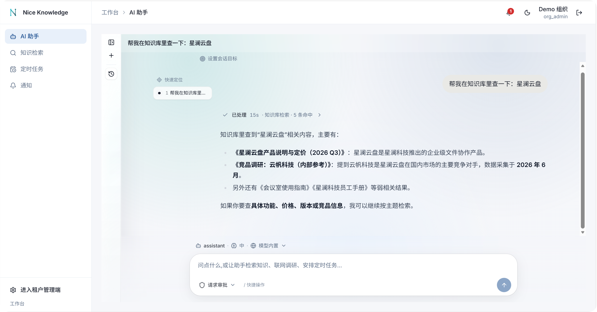
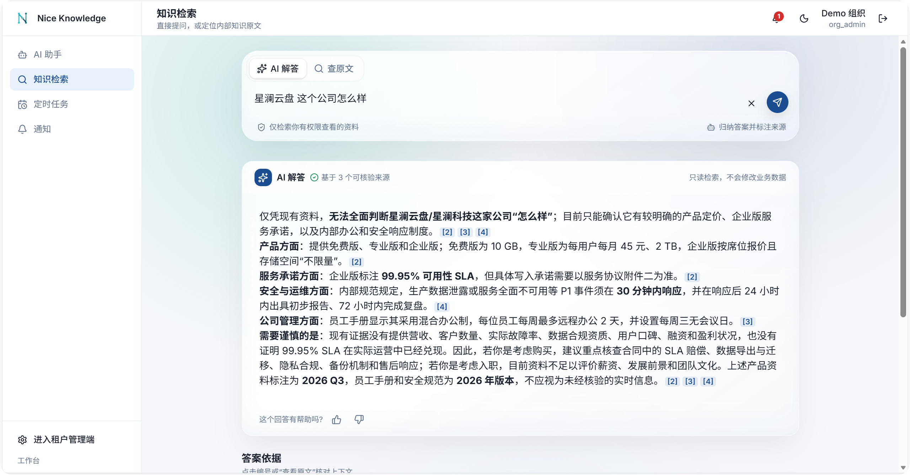
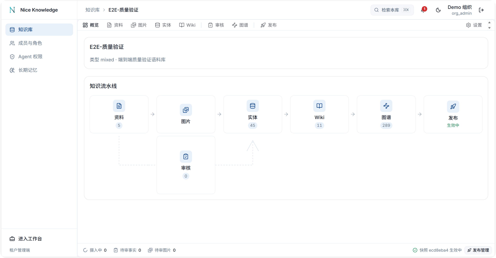
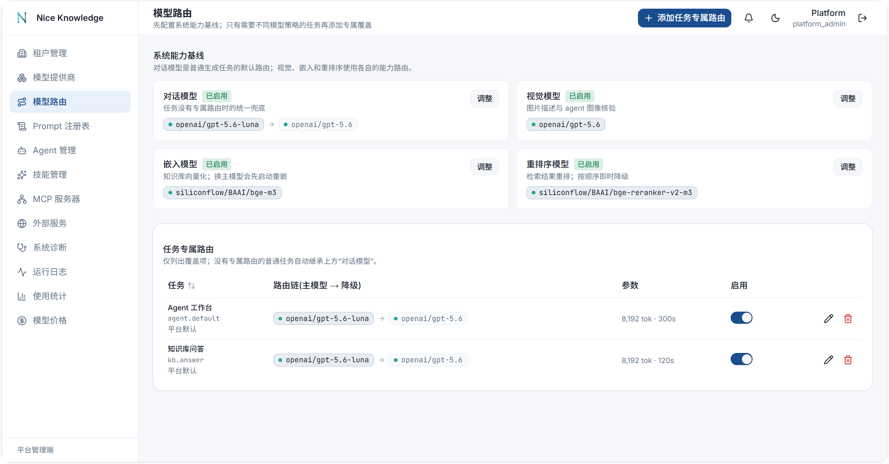
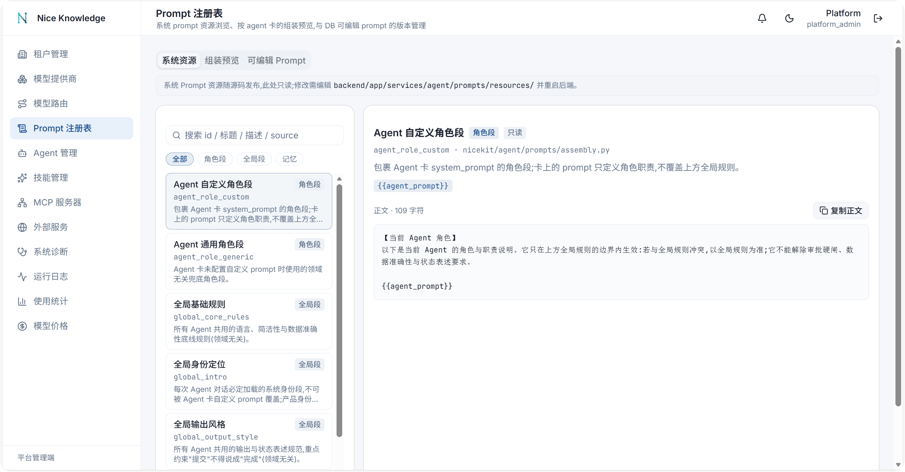
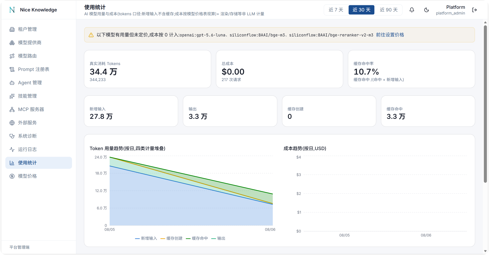
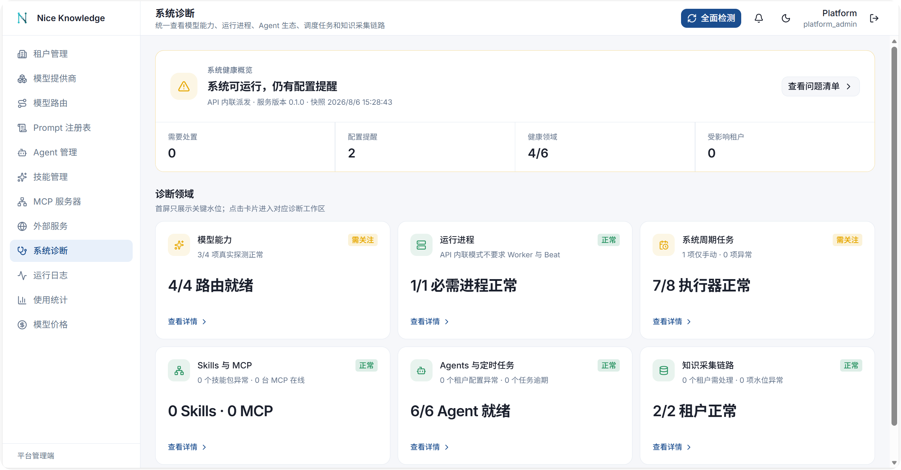

<div align="center">


# NiceKit

**多租户 Agent + 知识库平台 SDK**

把租户隔离、LLM 多模型路由、Agent 运行时和混合检索做成一个可安装的包,
让你的产品从第一天起就有一个能上生产的 AI 底座。

[](https://pypi.org/project/nicekit/)
[](https://www.python.org/downloads/)
[](LICENSE)
[](https://github.com/patrickleehua/nice-knowledge/actions/workflows/ci.yml)

[界面预览](#界面预览) · [快速开始](#快速开始) · [文档](docs/README.md) · [接入指南](docs/INTEGRATION.md) · [English](README.en.md)

</div>

---

## 这是什么

**NiceKit** 是一个**平台框架包**,不是工具库。它从一套已上生产的企业级 AI 应用中抽取而来,
装上并装配后,你的项目直接拥有多租户底座、LLM 多模型层、Agent 运行时、知识库与运维可观测性 ——
共 **228 个 REST 端点**(182 条路径)、**64 张表**、其中 **46 张开了 PostgreSQL FORCE RLS**。

**Nice Knowledge** 是本仓库随附的示例宿主:一个基于 NiceKit 搭建的知识工作台,
既能跑起来看完整产品形态,也是"这个 SDK 怎么用"的活文档。

## 界面预览

Nice Knowledge 把 NiceKit 的 Agent、知识检索与知识库流水线组装成了可直接运行的产品界面。
点击截图可查看原图。

<p align="center">
  <a href="images/demo/agent能力.png">
    
  </a>
  <br />
  <sub><b>AI 助手</b> —— 多轮工具调用、知识库检索、会话目标与审批在同一个工作台完成</sub>
</p>

<table>
  <tr>
    <td width="50%" align="center">
      <a href="images/demo/知识检索.png">
        
      </a>
      <br />
      <sub><b>知识检索</b> —— 基于可核验来源归纳回答并逐条标注引用</sub>
    </td>
    <td width="50%" align="center">
      <a href="images/demo/知识库流水线.png">
        
      </a>
      <br />
      <sub><b>知识库流水线</b> —— 资料、图片、实体、Wiki、图谱与发布状态一屏可见</sub>
    </td>
  </tr>
</table>

<details>
<summary><b>查看平台管理端:模型路由、Prompt、用量审计与系统诊断</b></summary>

<table>
  <tr>
    <td width="50%" align="center">
      <a href="images/demo/可降级模型链.png">
        
      </a>
      <br />
      <sub><b>可降级模型链</b> —— 按能力和任务配置主模型与降级顺序</sub>
    </td>
    <td width="50%" align="center">
      <a href="images/demo/动态提示词.png">
        
      </a>
      <br />
      <sub><b>动态 Prompt</b> —— 浏览系统资源、预览组装结果并管理可编辑版本</sub>
    </td>
  </tr>
  <tr>
    <td width="50%" align="center">
      <a href="images/demo/费用请求审计.png">
        
      </a>
      <br />
      <sub><b>用量与费用审计</b> —— 四桶 token 计量、请求成本与缓存命中趋势</sub>
    </td>
    <td width="50%" align="center">
      <a href="images/demo/系统诊断.png">
        
      </a>
      <br />
      <sub><b>系统诊断</b> —— 统一检查模型、进程、定时任务、Agent 与知识采集链路</sub>
    </td>
  </tr>
</table>

</details>

### 它解决什么

做一个带知识库的 AI 产品,真正费时间的从来不是接 LLM API,而是:

- 多租户数据怎么**硬隔离**,而不是靠每个查询记得带 `WHERE org_id = ?`
- Agent 调用有副作用的工具时,**谁批准**、批准到什么粒度、能不能撤销
- 检索为什么**召回不准**,以及怎么在语义近邻不构成证据时**老实拒答**
- 换模型、换 embedding、上下文超预算、provider 挂了 —— 这些**降级路径**怎么走

NiceKit 把这四件事都做完了,并且做成了你可以替换的扩展点。

### 它明确不做

- **不提供任何行业业务模型**。没有订单、工单、项目、客户这些概念 —— 由你定义,通过扩展点接进来。
- **不做数据库无关抽象**。强绑 PostgreSQL,这是刻意的:RLS、pgvector、zhparser 都不可替代。
- **不内置行业词表**。实体类型、prompt 领域文案、检索过滤字段全部由宿主注册,SDK 只带领域无关兜底。
- **不替你做前端**。示例前端是可裁剪的参考实现,不是发布的 npm 包。

## 核心能力

| 能力 | 具体内容 |
|---|---|
| **多租户底座** | 组织 / 用户 / 成员 / 邀请、JWT + 旋转式 refresh token、PostgreSQL `FORCE ROW LEVEL SECURITY`(连表 owner 也受约束,未设上下文时策略恒假)、三种接入模式 |
| **LLM 多模型层** | OpenAI / Anthropic 双协议归一、模型能力注册表、模型 ID 归一化(聚合器前缀 / Bedrock ARN / 量化标签 / 日期戳)、路由与降级链、provider 冷却、组织级预算与并发闸门、四桶 token 计量 |
| **Agent 运行时** | 多轮工具循环、**七轴权限审批**、AI 复核员、MCP 客户端、`SKILL.md` 技能、子 agent 委派、长期记忆、会话目标续跑、上下文压缩与工具结果双层预算、定时任务(到点起一个真实 agent run) |
| **知识库** | 文档摄入(Docling 版面理解 / 结构感知切片 / 上下文化 / 嵌入)、通用实体抽取与审核、快照发布与回滚、**四路混合检索**、知识图谱、wiki 生成、多媒体入库与审核、提示注入围栏 |
| **运维** | 健康 / 就绪探针、Prometheus 指标、服务心跳、provider 连通性探测、孤儿任务恢复、超时清扫、事务性发件箱 |
| **API** | `/api/v1` 下 18 个 router、228 个端点(认证 / 成员 / 管理端 / chat SSE / KB 全家 / 记忆 / 定时 / 通知 / 媒体) |

<details>
<summary><b>四路混合检索是哪四路</b></summary>

`structured`(按注册的实体类型做 JSONB 结构化过滤)、`sparse`(PostgreSQL FTS + zhparser 中文分词)、
`dense`(pgvector cosine,距离上限 0.62)、`graph`(active 图投影上 1–2 跳召回),
四路用 RRF(`k=60`)融合后交给 cross-encoder 重排;重排不可用则降级为纯 RRF。

**拒答门禁**:structured / sparse / must_include / graph 全为空、**仅 dense 命中**时直接返回空 ——
语义近邻不构成证据,不靠调距离阈值放行。

</details>

<details>
<summary><b>七轴权限是哪七轴</b></summary>

注册工具时用 `tool_permission()` 声明七个维度,权限层据此决定这次调用是自动执行、
走 AI 复核、要人工点确认、还是禁止 agent 调用:

| 轴 | 取值 |
|---|---|
| `effect` | `read` / `write` / `delete` / `transition` |
| `risk` | `routine` / `sensitive` / `critical` |
| `categories` | `local_data` / `network` / `external_cost` / `financial` / `destructive` / `workflow` / `export` |
| `reversibility` | `reversible` / `compensatable` / `irreversible` |
| `delegation` | `automatic` / `reviewable` / `user_required` / `agent_forbidden` |
| `scope` | `session` / `resource` / `organization` |
| `material_arguments` | 参与授权指纹、进审批卡展示的实质参数 |

坏元数据在 **import 期**就炸,不会拖到运行时。

</details>

## 安装

```bash
pip install nicekit
# 或
uv add nicekit
```

**技术前提**(不可替换):Python 3.13+、PostgreSQL(需 `pgvector` + `pg_trgm` + `zhparser` + `pgcrypto`)、
Redis、S3 兼容对象存储。Celery 可选(有 inline 兜底)。

> `pip install` 装完不能空跑 —— 上面四件基础设施必须先就位。用本仓库的 `docker compose` 是最快的路。

## 快速开始

### 跑起随附的示例应用

```bash
git clone https://github.com/patrickleehua/nice-knowledge.git
cd nice-knowledge

# 1) 起基础设施:postgres 5433 / redis 6380 / minio 9010
docker compose up -d

# 2) 建表(64 张表 + 46 张开 FORCE RLS + 中文检索配置)
cd packages/nicekit && uv run --package nicekit alembic upgrade head && cd ../..

# 3) seed + 启动
cp apps/demo/backend/.env.example apps/demo/backend/.env
cd apps/demo/backend
uv run --package nicekit-demo-backend python -m demo_backend.seed
uv run --package nicekit-demo-backend python run.py
```

默认账号 `admin@demo.example.com` / `demo-admin-2026`,登录需填 `org_slug`(`platform` 或 `demo`)。
前端另开一个终端:`cd apps/demo/frontend && pnpm install && pnpm dev`。

> **PostgreSQL 必须用 `deploy/` 里的定制镜像**,官方 `postgres` 镜像不带那三个扩展,迁移会直接失败。
>
> **Windows 上必须走 `run.py`**,不要直接 `uvicorn`。uvicorn 在 win32 硬编码 `ProactorEventLoop`,
> psycopg async 不支持它,症状是 HTTP 正常响应但所有数据库后台任务静默失败。

### 在自己的项目里用

```python
# main.py —— 一个能登录、能配模型、能建知识库、能和 agent 对话的平台
from nicekit.api.v1.router import default_routers
from nicekit.runtime.app_factory import create_app
from nicekit.runtime.bootstrap import install_default_ports

install_default_ports()
app = create_app(routers=default_routers())
```

```python
# seed.py —— 幂等,每次部署跑一次
from nicekit.core.db import get_session_factory
from nicekit.runtime.bootstrap import bootstrap_platform

async with get_session_factory()() as session:
    report = await bootstrap_platform(session)
    await session.commit()
```

完整的三十分钟起步走 [docs/SDK-GUIDE.md](docs/SDK-GUIDE.md)。

## 接入已有的身份体系

认证入口收敛在 `get_org_context` **一个依赖**上,换掉它背后的 `PrincipalResolver`,
SDK 就接进你现有的账号体系 —— 改的是装配代码,不是数据模型。

| | A 全托管 | B 桥接 | C 单租户 |
|---|---|---|---|
| 适用 | 全新产品,直接用 SDK 的多租户底座 | 宿主已有租户与登录,不想维护第二套账号 | 无租户概念,或认证由网关做完 |
| 谁签发凭据 | SDK(JWT + 旋转 refresh) | 宿主 | 网关 / 无 |
| `set_principal_resolver` | 不调用 | 必须 | 必须 |
| 挂 `auth` / `members` router | 是 | 否 | 否 |
| RLS | 开 | 开 | 开 |

```python
# 桥接模式:把宿主的 token 翻译成 Principal
from nicekit.api.deps import Principal, set_principal_resolver
from nicekit.api.v1.router import AUTH_ROUTER_NAMES, default_routers
from nicekit.tenancy import subject_uuid, tenant_uuid

async def resolver(request: Request) -> Principal:
    claims = verify_host_token(request.headers["authorization"])   # 本地验签
    return Principal(
        org_id=tenant_uuid(claims["company_id"]),   # 外部主键 → UUID,确定性派生,无需映射表
        user_id=subject_uuid(claims["user_id"]),
        role=ROLE_MAP[claims["role"]],
    )

set_principal_resolver(resolver)                    # 必须早于 create_app
app = create_app(routers=default_routers(exclude=AUTH_ROUTER_NAMES))
```

三种模式的完整可复制方案、RLS 边界、常见坑与上线前自检脚本:[docs/INTEGRATION.md](docs/INTEGRATION.md)。

## 扩展点

SDK 内部不 import 任何宿主代码。业务定制全部走这些接口:

| 我想… | 扩展点 |
|---|---|
| 让 agent 会做我的业务动作 | `ToolRegistry.register(...)` 注册自定义工具 + 七轴权限声明 |
| 让权限层看懂我的业务对象 | `register_resource_resolver(...)` 把工具参数解析成作用域根 |
| 给 agent 注入实时业务上下文 | `register_context_provider(...)`,每轮往 system prompt 注入一段(不落表、超预算整段丢弃) |
| 让知识库认识我的领域对象 | `bootstrap_platform(entity_type_specs=[...])`,一份 spec 即可,**不用建表** |
| 换通知渠道 / trace 落账 / KB 引用扫描 | `set_notifier` / `TraceSink`、`UsageSink` / `register_reference_scanner` |
| 加业务角色 | `register_roles("editor")` + `register_write_roles("editor")` |
| 加自己的业务表 | 独立 alembic 分支 + `op_enable_org_rls(op, "your_table")` |

全部 44 个注册接口的签名与用途见 [docs/SDK-GUIDE.md §4](docs/SDK-GUIDE.md#4-扩展点全清单)。

## 架构

```text
core        config(分域) / db(RLS) / security + secretbox / cache / ratelimit / logging / metrics
  ↑
tenancy     组织·用户·成员·邀请 / JWT / 角色注册表 / 用量计量 / RLS 迁移 helper
  ↑
llm         provider 双协议 / 能力注册表 / ID 归一化 / 路由降级 / sinks
  ↑
kb ── agent ── capabilities        三者互不依赖,都只向下依赖
  ↑
operations / runtime               运维可观测性 / 装配·派发·可靠性·celery
  ↑
api                                REST routers
```

```text
packages/nicekit/     SDK 包(发布到 PyPI 的就是它)
apps/demo/backend/    Nice Knowledge 示例宿主 + 四个扩展点的最小实现
apps/demo/frontend/   Nice Knowledge 示例前端(Next.js)
deploy/               PostgreSQL 定制镜像(pgvector + pg_trgm + zhparser)
docs/                 全部文档
```

## 文档

| 文档 | 读它当你想 |
|---|---|
| [docs/README.md](docs/README.md) | 按需求找文档 —— **从这里开始** |
| [docs/SDK-GUIDE.md](docs/SDK-GUIDE.md) | 在新项目里用 NiceKit:三十分钟起步、扩展点全清单、常见配方 |
| [docs/INTEGRATION.md](docs/INTEGRATION.md) | 把 NiceKit 接进已有的租户与认证体系 |
| [docs/AGENT-BRIEF.md](docs/AGENT-BRIEF.md) | 上文的结构化速查版,**给 AI 编码助手照抄用** |
| [docs/DATA-MODEL.md](docs/DATA-MODEL.md) | 64 张表逐表详解、RLS 机制、三种模式下的表使用矩阵 |
| [AGENTS.md](AGENTS.md) | 在**本仓库**里工作的 AI 助手须知:命令、架构约束、红线 |
| [CONTRIBUTING.md](CONTRIBUTING.md) | 开发环境、代码规范、测试、PR 流程 |
| [docs/RELEASING.md](docs/RELEASING.md) | 发版流程 |

## 项目状态

`0.1.2`,**公开 API 尚未冻结**。0.x 阶段次版本号可能带不兼容变更,升级前请读 [CHANGELOG.md](CHANGELOG.md)。

测试:135 个测试文件。`cd packages/nicekit && uv run --package nicekit pytest` 实测
**1967 passed / 4 skipped / 53 deselected,约 45 秒,不需要任何外部服务**;
被 deselect 的 53 个标了 `live`(需真实 PostgreSQL 或 LLM API),用 `-m live` 显式开启。

## 贡献

欢迎 issue 与 PR。开始之前请读 [CONTRIBUTING.md](CONTRIBUTING.md) ——
尤其是"SDK 内部不 import 宿主代码"和"带 `org_id` 的表必须开 RLS"这两条,它们是硬约束。

## 协议

[Apache License 2.0](LICENSE) © 2026 patrickleehua
